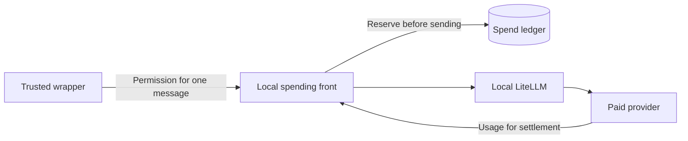

# Operations guide

For the person who installs agenttalk, keeps a team running, pays for model
service and recovers the machine when something fails. This is a collection of
operating procedures for agenttalk 0.100.0, primarily on Windows.

## In plain words

Keep a separate, fixed copy of agenttalk for running the team. An upgrade changes
which copy runs; it should not erase messages, session records or spending history.
The supervisor keeps agents running, while the paid gateway checks spending before
each provider call. Both can refuse work when their saved evidence is incomplete.
Stop at a refusal, keep the evidence, and use the recovery procedure for that
component. A backup helps recover files; it cannot undo work already done elsewhere.

If agenttalk is already installed, start with this check in your operator shell:

```powershell
agenttalk --version
```

For this guide's release, the expected output is `agenttalk 0.100.0`. If the command is
missing or reports another version, use the explicit Python path below; do not
assume the first command found on `PATH` is the team's runtime.

## Words used in this guide

- **Store**: the `.agenttalk` folder of a project. It holds the messages, the team list and the saved state.
- **Agent**: one member of your team, a Claude or Codex session with a name.
- **Wrapper**: the small program that starts one agent's model tool, passes it messages and records that it is alive.
- **Heartbeat**: a time stamp an agent or wrapper writes now and then to show it is alive. A fresh one does not prove
  the agent is making progress.
- **Supervisor**: the program that watches the team and relaunches stopped agents by fixed rules.
- **Kill switch**: the file `supervisor.kill`. While it exists the supervisor takes no actions. Agents that are already
  running, and the paid gateway, keep running.
- **Runtime**: one fixed, installed copy of agenttalk (a Python environment) that runs the team.
- **Paid gateway** (just "gateway"): a local service that sits between your paid agents and the model provider, counts
  every call and refuses calls that would pass your limits.
- **Ledger**: the gateway's own database of every paid call and amount. It is accounting evidence, not a log.
- **Reservation**: money the gateway sets aside before a call, so a call can never overrun a limit. It is settled when
  the real usage is known.
- **Hold**: a stop on new paid calls, kept until you clear it.
- **Canary**: the first real paid call, which you check by hand against the provider's dashboard.
- **Child cap**: the spending, call and time limit of one paid message. **Quota lease reference**: an identifier from
  a separate controller program that ties one paid message to an approved budget. Leave the rule that requires it
  switched off unless you run such a controller.
- **Maintainer**: the people who publish agenttalk releases and can supply what a release does not ship, such as the
  acceptance client for the first paid call.
- **Liaison**: the agent that speaks to you for the team. **Sole lead**: the team's only lead agent, where there is one.

## Choose a procedure

- [Install a fixed runtime](#install-a-fixed-runtime)
- [Switch runtimes or roll back](#switch-runtimes-or-roll-back)
- [Host and recover the supervisor](#host-and-recover-the-supervisor)
- [Set up the paid gateway](#set-up-the-paid-gateway)
- [Understand and change spending limits](#understand-and-change-spending-limits)
- [Stop and recover the paid gateway](#stop-and-recover-the-paid-gateway)
- [Back up and restore](#back-up-and-restore)
- [Find logs and scheduled tasks](#find-logs-and-scheduled-tasks)
- [Clean up scratch files](#clean-up-scratch-files)

### If something is wrong, start here

| What you see | Go to |
| --- | --- |
| Agents have stopped answering | [Check whether the team has stopped answering](#check-whether-the-team-has-stopped-answering), then [Pause, stop and recover](#pause-stop-and-recover) |
| An agent keeps being relaunched, or the supervisor says its restart budget is spent or a process is still owned | [Pause, stop and recover](#pause-stop-and-recover), steps 4 and 5 |
| An upgrade or a runtime switch went wrong | [Roll a runtime or release back](#roll-a-runtime-or-release-back) |
| `gateway start` timed out, or the gateway is not ready | [The `start` timeout paragraph](#prepare-a-new-windows-machine) and [Stop and recover the paid gateway](#stop-and-recover-the-paid-gateway) |
| The gateway refuses calls, shows a hold or an uncertain call | [Stop and recover the paid gateway](#stop-and-recover-the-paid-gateway) |
| Paid workers stay blocked after a fresh setup | [Accept the first paid call](#accept-the-first-paid-call) |
| You need to change the spending limits | [Change limits today](#change-limits-today-an-attended-re-initialization) |
| A backup failed, or you need to restore | [Make and keep a backup](#make-and-keep-a-backup), [Restore manually](#restore-manually) |
| You cannot tell where a log or a task lives | [Find logs and scheduled tasks](#find-logs-and-scheduled-tasks) |

## Before changing a running installation

Use an attended maintenance window. Tell the team which agents will stop and keep
one operator in charge. Run one step, inspect its result, then continue. A nonzero
exit is a stop point unless the procedure explicitly explains it.

All paths in angle brackets are placeholders. Replace them before pasting. These
PowerShell variables name the project containing `.agenttalk` and the installed
tool interpreter; they are not model-service credentials:

```powershell
$Project = '<checkout>'
$ToolPy = '<runtime-root>\v0.100.0\Scripts\python.exe'
```

In this guide, the full form of an operating command is:

```powershell
& $ToolPy -m agenttalk --root $Project status
```

Use a fresh operator shell, not a model child's shell. An inherited
`AGENTTALK_ROOT` can select a different store; an inherited scratch-store fence
deliberately refuses other stores. Confirm that `AGENTTALK_ROOT`, if set, names
`$Project`, and that no test-store environment is active. Never relax a test
fence to make a rehearsal reach the live store.

Before a change, record the old runtime's absolute path, version, installed
package location, selected PowerShell path, task names and launcher settings.
Take the backups described below. Keep the old runtime until recovery has been
checked. Do not replace a running virtual environment in place.

## Install a fixed runtime

A runtime is a Python environment containing one installed agenttalk release.
It is separate from the checkout in which agents edit files. Python 3.10 or newer
is required. Choose an interpreter supported by your operating system, and on
Windows check that it supplies both `python.exe` and `pythonw.exe`.

1. Choose a released tag and inspect its release notes for migrations and rollback
   restrictions. These example values select this guide's release:

   ```powershell
   $Version = '0.100.0'
   $Source = '<source-checkout>'
   $BuildTree = '<scratch>\agenttalk-release-source'
   $Builder = '<scratch>\agenttalk-wheel-builder'
   $BasePy = '<python-install>\python.exe'
   $Runtime = "<runtime-root>\v$Version"
   git -C $Source fetch origin --tags
   ```

2. Use a new, empty build location. Check out the tag separately from working
   files and record the commit printed by the second command:

   ```powershell
   git -C $Source worktree add --detach $BuildTree "v$Version"
   git -C $BuildTree rev-parse HEAD
   ```

   An annotated tag's object ID can differ from this commit. Keep the commit with
   the release record. Stop if the tag or its source is not the release you chose.

3. Build a wheel, the installable package, in a disposable builder:

   ```powershell
   & $BasePy -m venv $Builder
   & "$Builder\Scripts\python.exe" -m pip install 'build>=1.2'
   & "$Builder\Scripts\python.exe" -m build --wheel $BuildTree
   ```

   Expect `agenttalk-$Version-py3-none-any.whl` in `$BuildTree\dist`. Record its
   SHA-256 with `Get-FileHash`. Keep the wheel so recovery need not rebuild it.

4. Create the new runtime and install that wheel, without an editable install:

   ```powershell
   & $BasePy -m venv $Runtime
   $NewPy = "$Runtime\Scripts\python.exe"
   & $NewPy -m pip install --no-deps "$BuildTree\dist\agenttalk-$Version-py3-none-any.whl"
   & $NewPy -I -m agenttalk --version
   & $NewPy -I -c "import agenttalk; print(agenttalk.__file__)"
   Test-Path "$Runtime\Scripts\pythonw.exe"
   ```

   Expect the chosen version, a package path inside this runtime's `site-packages`,
   and `True` on Windows. The package has no mandatory Python dependencies at this
   release; LiteLLM and the model CLIs are separate installations.

5. Check the normal launch environment too. Remove unintended `PYTHONPATH`,
   `PYTHONHOME` and `PYTHONUSERBASE` overrides in the operator/launcher environment,
   then repeat the import check **without `-I`**, from the launch working directory.
   `-I` checks the installation in isolation; it does not prove what a normal
   wrapper or scheduled task will import.

   Generated supervisor scripts and the project shim deliberately add
   `<checkout>\src` when the project is an agenttalk source checkout. A pinned
   interpreter alone does not override that behavior. For an installed-only host,
   use a project root without that source tree. For an existing source-backed host,
   review its actual launch environment and source revision before switching; do
   not edit generated scripts by hand to conceal the difference.

On Linux, use `<runtime>/bin/python` and `<runtime>/bin/agenttalk` instead of the
Windows `Scripts` paths. The supervisor host described here is PowerShell on
Windows; the gateway also has a Linux user-service host described below.

## Switch runtimes or roll back

### Switch the team's tool runtime

Changing a variable in your shell does not change an already-running wrapper.
Your own launch scripts are local operating files, not scripts supplied by this
repository.

1. Let active turns finish. Save context for work that must resume. Pause new
   dispatch, put the supervisor kill switch in place, and stop its host as described
   in the next section. Stop each affected wrapper by its verified process identity;
   do not kill every Python process on the machine.
2. Back up `.agenttalk` and the local launcher/configuration files. Record the old
   values of `AGENTTALK_PY`, `AGENTTALK_PYTHON` and each configured
   `launch.windows_file` that selects the wrapper Python. These are distinct:
   `AGENTTALK_PY` is the model-side bus interpreter; `AGENTTALK_PYTHON` can override
   the generated command shim. Also record each affected agent's `auto_restart`
   value in `supervisor.json`.
3. Point the intended launchers and wrapper entries at the verified new interpreter.
   Do not replace the real Claude/Codex executable after the wrapper's `--` separator.
   Retain workspace paths, agent identities and session files. In the same edit,
   while the kill switch is still in place, set `auto_restart` to `false` on every
   affected agent's entry except the one you will start first: the supervisor
   relaunches stopped agents whose `auto_restart` is true, so otherwise step 5
   would start them all at once on the new, untried runtime.
4. With the supervisor host still stopped, remove its kill switch and regenerate
   scripts using the new interpreter:

   ```powershell
   & $NewPy -m agenttalk --root $Project supervise --refresh-scripts
   ```

   This preserves configuration and runtime state. Inspect the resulting Python
   pin and source-import behavior. Refresh can refuse a live supervisor. If it was
   interrupted, keep the host stopped and repeat it; files are replaced individually,
   not as one all-or-nothing group.
5. Start that one agent through its normal host; if the host is the supervisor,
   then among the affected agents it now launches only the one whose `auto_restart`
   is true. Check the version and import path in that launch context, `status`,
   `doctor`, and a fresh wrapper heartbeat. Resume the rest only after the first agent can receive and answer a
   harmless message: set the next agent's `auto_restart` back to its recorded value,
   one agent at a time, checking each the same way. Stop at the first failure.

The paid gateway's task has its own interpreter pin. Use the separate task-switch
procedure below; a wrapper switch does not move that task.

### Roll a runtime or release back

1. Stop dispatch, put the supervisor kill switch in place (see "Pause, stop and
   recover", step 1) and stop the affected hosts/wrappers. Preserve the failing
   version, logs, current state and a new backup before changing anything else, and
   record each affected agent's `auto_restart` value in `supervisor.json`.
2. Check whether the old release can read the current saved formats. A gateway
   schema migration may deliberately make older code refuse the ledger. Do not
   bypass that refusal, edit version fields or restore an older spend balance.
3. If compatible, restore the exact old launcher settings and interpreter. In the
   same edit, while the kill switch is still in place, set `auto_restart` to `false`
   on every affected agent's entry except the one you will verify first: the
   supervisor relaunches stopped agents whose `auto_restart` is true, so otherwise
   step 4 would restart them all at once. Then refresh supervisor scripts with the
   old release while the host is stopped and the kill switch is removed (refresh is
   refused while `supervisor.kill` exists); if that release cannot read current
   state, stop for a recovery plan instead.
4. Restart and verify that one agent through its normal host; if the host is the
   supervisor, then among the affected agents it now launches only the one whose
   `auto_restart` is true. Then resume the others: set each agent's `auto_restart`
   back to its recorded value, one agent at a time, verifying each the same way. For
   the gateway, stop and unregister the new task before reinstalling the old
   registration as below.
5. If file restoration is necessary, use the manual restore procedure. Reconcile
   actions performed since the backup before resuming: a rollback cannot undo a
   sent message, a merged change or a provider charge.

Rolling back a local installation does not require moving or deleting a published
Git tag. Keep release artifacts immutable. If a bad release needs a public correction,
publish a separately reviewed corrective release rather than replacing its tag.

## Host and recover the supervisor

The supervisor polls the team's state and applies the configured launch/recovery
rules. A wrapped agent is preferred for unattended work: the wrapper records its
own lifecycle and the model process's progress. A heartbeat alone does not prove
that a model process is making progress.

### Set up the host

Prerequisites: an initialized project, configured roster, installed model CLIs,
and a same-user operator account able to run them. Do not enable automatic agents
until their launch settings and permitted workspace have been reviewed.

1. Generate the configuration and helpers with the chosen runtime:

   ```powershell
   & $ToolPy -m agenttalk --root $Project supervise --init
   ```

   This creates `.agenttalk/supervisor.json`, `supervisor.ps1`,
   `supervisor-task.ps1`, `deadman.ps1` and `bin/agenttalk.cmd`. Existing files are
   preserved unless explicitly refreshed. The command also prints an optional hook
   snippet. The activity hook (`supervise --install-activity-hook`) is what lets the
   supervisor treat a stuck agent as stuck: until it is installed and an agent's
   `activity_hook` setting is true, that agent's stale heartbeat gives a warning, not
   a restart. This guide sets agents up through the wrapper, so you can skip the hook
   unless you also run an agent without the wrapper and want it restarted when stuck. Do not use `init --force` as a repair
   shortcut for the whole message store.
2. Edit `supervisor.json`: replace example agents and launch placeholders; use the
   actual roster names. For a wrapped seat, set `wrapped: true`, use the tool
   Python as `launch.windows_file`, and put `-m agenttalk --root {ROOT} wrap
   --for <agent> --cli <claude-or-codex> --loop -- <real-cli-path>` in
   `launch.windows_args` as **separate JSON array elements**. Do not add
   `{SESSION_ARGS}`: the wrapper owns session continuity. Choose permissions and
   sandbox settings consciously; unattended agents cannot answer permission prompts.
3. Select a supported PowerShell 7 host:

   ```powershell
   & $ToolPy -m agenttalk --root $Project supervise --select-pwsh
   ```

   Read the returned JSON `path` and warnings, then set `$Pwsh` to that absolute
   path (`$Pwsh = '<path-from-the-JSON>'`). Selection records `.agenttalk/powershell-host.json`. Windows PowerShell
   5.1 and PowerShell 6 are refused. Use a supported stable PowerShell 7 release;
   older 7.0–7.3 and prerelease hosts produce warnings. An explicit `--pwsh` path
   is checked without silently falling back to another executable.
4. Inspect the report and proposed actions:

   ```powershell
   & $ToolPy -m agenttalk --root $Project supervise --report
   & $ToolPy -m agenttalk --root $Project supervise --plan
   ```

   Resolve configuration and identity errors before starting automatic recovery.
   A bare `--plan` has no executor process snapshot, so it can report unknown
   process evidence; it is not a substitute for the running host's observations.
   A foreground trial uses `$Pwsh -NoLogo -NoProfile -NonInteractive -File
   "$Project\.agenttalk\supervisor.ps1"`, invoked with PowerShell's `&` operator.
   Stop that host before installing/starting a second host.
5. Choose one project-specific task name. `agenttalk-supervisor-example` below is
   an example, not a name every project should share:

   ```powershell
   $SupervisorTask = 'agenttalk-supervisor-example'
   $TaskHelper = "$Project\.agenttalk\supervisor-task.ps1"
   & $Pwsh -NoLogo -NoProfile -NonInteractive -File $TaskHelper -Action install -TaskName $SupervisorTask
   & $Pwsh -NoLogo -NoProfile -NonInteractive -File $TaskHelper -Action start -TaskName $SupervisorTask
   & $Pwsh -NoLogo -NoProfile -NonInteractive -File $TaskHelper -Action status -TaskName $SupervisorTask
   ```

   Inspect each result before the next command. Install refuses an existing task.
   The default name `agenttalk-supervisor` is shared across projects of the same
   Windows user, so pass your chosen name to **every** helper action. The action
   pins the selected PowerShell and this project's script. The task starts at
   logon, allows delayed starts and ignores a second simultaneous instance. If the
   host program fails, Windows restarts it, up to 999 times, one minute apart, so a
   host that fails at once can loop quietly: check `status` and the report instead
   of assuming a running task is a healthy supervisor.

### Pause, stop and recover

These steps use `$ToolPy` and `$Project` (see the top of this guide) and three more values from "Set up the host".
In a new shell, set them again:

```powershell
$Pwsh = '<path-from-select-pwsh>'
$SupervisorTask = '<your-task-name>'
$TaskHelper = "$Project\.agenttalk\supervisor-task.ps1"
```

1. To inhibit new supervisor actions, create the kill switch:

   ```powershell
   New-Item -ItemType File -Path "$Project\.agenttalk\supervisor.kill" -Force
   ```

   Its contents do not matter. Reports remain available. This does **not** stop
   already-running model processes or the paid gateway.
2. For maintenance, stop the host too:

   ```powershell
   & $Pwsh -NoLogo -NoProfile -NonInteractive -File $TaskHelper -Action stop -TaskName $SupervisorTask
   & $Pwsh -NoLogo -NoProfile -NonInteractive -File $TaskHelper -Action status -TaskName $SupervisorTask
   ```

   Confirm the task is no longer Running and its recorded supervisor process is
   gone. Stop a foreground host separately if one was used. Keep the kill switch
   while inspecting processes and repairing configuration.
3. Read `supervise --report`, `supervise --plan`, `status` and `doctor`. A protected
   agent is not automatically killed. Unknown process ownership is a reason to
   stop and investigate, not permission to kill a PID by name.
4. For a normal agent restart after the cause is fixed:

   ```powershell
   & $ToolPy -m agenttalk --root $Project request-restart --for '<agent>' --from '<operator-or-lead>' --reason 'operator repaired launch settings'
   ```

   `--from` must be the configured liaison or, when no liaison is configured, the
   sole lead; any other name is refused with "requester is not authorized". An
   operator shell has no agent identity of its own, so without `--from` the command
   stops with "no agent identity". If the agent is protected (the liaison or a
   lead), also add `--force-protected`. If it is protected and still has a fresh
   heartbeat, the restart ends a live seat, so also add
   `--acknowledge-live-protected-kill`, which only the liaison can give. The
   command refuses those two flags together with `--clear-restart-budget`. The
   request is handled by the supervisor when actions resume. Automatic
   relaunches have a restart budget (default four in one hour). A manual restart
   request re-arms that budget. `--clear-restart-budget` clears only the budget;
   it does not itself kill or launch anything. Do not repeatedly re-arm a crash loop.
5. If process ownership is held, keep the kill switch and host stopped. An
   authorized liaison, or the sole lead where applicable, must verify every
   recorded process/start time is gone and use the attended reset:

   ```powershell
   & $ToolPy -m agenttalk --root $Project supervise --reset-process-tree-ownership `
     --from '<liaison>' --for '<agent>' --hold-source-hash '<current-hold-hash>' `
     --verified-launch-nonce '<recorded-nonce>' --acknowledge-no-live-supervisor `
     --acknowledge-owned-processes-stopped --reason 'operator verified the recorded processes are gone'
   ```

   Copy the current hash and nonce from the reported evidence. This records a
   recovery boundary; it never stops processes for you. Missing or ambiguous
   evidence needs manual investigation, not fabricated acknowledgements.
6. If supervisor state is corrupt, preserve `supervisor-state.json` and
   `supervisor-state.json.bak`. A valid backup can be read as a fallback;
   both invalid means no automatic action. Do not delete both to obtain an empty
   state. Repair with the host stopped and ownership accounted for.
7. To resume, keep the host stopped while removing `supervisor.kill`, refresh
   scripts if the runtime changed, then start the one intended host and verify a
   fresh report. Refresh is itself refused while the kill switch is present.

To change the scheduled PowerShell host: stop and prove the old host gone,
uninstall that project's task, select the new PowerShell, refresh scripts,
install and start. Do not register another task alongside the old one. The
uninstall uses the same helper:

```powershell
& $Pwsh -NoLogo -NoProfile -NonInteractive -File $TaskHelper -Action uninstall -TaskName $SupervisorTask
```

### Check whether the team has stopped answering

Run this independently of the supervisor's polling loop:

```powershell
& $ToolPy -m agenttalk --root $Project deadman --threshold-seconds 900 --json
```

It checks overdue mail/control work without reading message content or depending
on supervisor state. Exit 0 means no mail or control work is overdue (stale unread
responses count only with `--alarm-unread-response`). Exit 3 is an alarm: such
work is overdue, or the check itself hit an error (read the report's `errors`). Exit 2 means a bad option. Read the report as well. Unread response alarms are
optional with `--alarm-unread-response`. The generated `deadman.ps1` is a helper;
`supervise --init` does **not** install a separate periodic deadman task. If you
schedule it, record that task's name, interval and where its alarm goes.

A deadman on the same machine cannot alert while that machine is off. An
independent host/monitor and an operator-reachable notification route are needed
for that guarantee; agenttalk does not supply them merely by generating the helper.

## Set up the paid gateway

**Read this first.** You can do everything in this section yourself except the last
step, the first paid call. That step needs an acceptance client that this release
does not ship (see "Accept the first paid call"). Ask the maintainer for it before
your maintenance window. Until it is done the gateway can be running and "ready",
but every paid worker stays blocked (`worker_spend_ready` is false, with
`dashboard_canary_absent`), and nothing is spent.

This gateway is the built-in OVH/Qwen route, not a general provider selector.
The model and provider endpoint are pinned by the release. The public front listens
only on `127.0.0.1:4000`; LiteLLM listens separately on `127.0.0.1:4001`.



These controls protect against accidental and interrupted use. They do not isolate
secrets from a hostile process running as the same operating-system user. Use a
dedicated account/machine when that separation is required. Do not expose either
loopback port through a public proxy.

### Prepare a new Windows machine

1. Install and verify the tool runtime above. Install the actual Claude CLI for
   wrapped `ovh-qwen` workers. Separately prepare a trusted LiteLLM environment
   with its proxy dependencies; record and retain its exact package versions.
   It is not bundled with agenttalk. A version-specific install takes the form
   `python -m pip install 'litellm[proxy]==<approved-version>'` inside that separate
   environment. Replace the version with the one approved for your deployment.
2. Choose the Windows user that will run the gateway. Its local application-data
   directories hold the ledger and secrets. These are **per-user, not per-project**;
   a second checkout under the same user is not a second independent installation.
   Confirm that no old installation or listener already uses these locations/ports.
3. Put the provider key in `%LOCALAPPDATA%\agenttalk-ovh\api_key.txt`, accessible
   only to the intended account and required administrators. Use a secure local
   editor/secret provisioner. Never put the key in a command argument, the bus,
   repository, supervisor configuration or a pasted diagnostic. Keep `OVH_KEY` and
   `ANTHROPIC_API_KEY` absent from the supervisor/operator launch environment.
4. Observe the provider dashboard's current month-to-date spend and record when
   and where it was observed. Record the figure excluding VAT: every amount the gateway
   counts is excluding VAT. If your dashboard shows only a tax-inclusive figure, stop
   here and wait for the maintainer's answer on how to convert it; do not initialize
   with a figure you cannot place. Choose the three limits below. Do not reuse another
   machine's opening figure or assume the provider account has no other spend.
5. Initialize once. The following amounts are **examples only**, not recommended
   defaults or an operator budget. Replace all four figures with your approved
   figures and provide your actual observation description:

   ```powershell
   & $ToolPy -m agenttalk --root $Project gateway init `
     --litellm-executable '<litellm-runtime>\Scripts\litellm.exe' `
     --opening-eur 2 --opening-evidence 'provider dashboard observed at <UTC time>' `
     --soft-stop-eur 12 --cutoff-eur 15 --ceiling-eur 20
   ```

   There is also an optional `--reasoning-param NAME=VALUE`; leave it out unless the
   maintainer gives you one. Expect `initialized: true`, a generation and policy hash. Save this non-secret
   result. Initialization creates the ledger, markers, configuration and tokens;
   it does not activate a task or write the provider key. A partial existing install
   is refused. Do not delete leftovers and retry without investigating them.
6. Verify/install child caps, register the task and start it, checking each result:

   ```powershell
   & $ToolPy -m agenttalk --root $Project gateway cap-install
   & $ToolPy -m agenttalk --root $Project gateway task-install
   & $ToolPy -m agenttalk --root $Project gateway start
   & $ToolPy -m agenttalk --root $Project gateway status
   ```

   Fresh initialization already creates the current child-cap/binding-capable
   ledger. `cap-install` verifies that setup; `binding-install` is for an older
   ledger migration, not a reason to reset a new one. Do not turn on
   `binding-required` until your controller supplies quota lease references.

   The Windows task must use `pythonw.exe` beside the selected `python.exe`.
   LiteLLM starts without a console too. Registration refuses a foreign task and
   never replaces an existing one to fix its action. Record the returned task name.
7. Inspect `ready` and `worker_spend_ready` separately. Operational `ready` can be
   true before a paid verification call has been accepted. New workers remain
   blocked with `dashboard_canary_absent` until the next procedure succeeds.

If `start` times out, **do not immediately run it again**. The command waits about
30 seconds; a cold LiteLLM start has up to 120 seconds. Inspect status and the
registered task. A timeout does not undo a launch, and an absent public listener
alone does not prove no child is still starting. For a deliberate retry, stop with
the owning runtime, prove the task/processes stopped and both ports free, then start
once. Other errors, such as a policy or identity refusal, require their own repair.

### Accept the first paid call

This is an attended, paid check, not an automated installation test.
`canary-verify` compares a call that **already settled**; it does not send one.
There is no shipped `gateway canary-send` command in this release.

1. Keep all paid workers stopped. Arrange an operator-reviewed acceptance client
   for this release before the maintenance window. It must obtain a message-scoped
   child capability through the trusted controller interface, send a bounded call
   through the public front, consume the response completely, and retain its
   settled attempt ID. A plain provider call or the static front token is not a
   substitute. The normal paid wrapper intentionally refuses to bootstrap itself
   before a canary exists. If you do not have that acceptance client, stop here
   and ask the maintainer for one; do not disable the check.
2. Record the dashboard balance (excluding VAT, as at initialization), run the one
   attended acceptance call, and wait until its charge is visible. With other paid work stopped, match that change to
   the settled ledger attempt. The attempt ID is in the ledger's `attempts` table;
   a maintainer can read it using SQLite read-only mode. Do not edit the table.
3. Verify the observed, nonzero change:

   ```powershell
   & $ToolPy -m agenttalk --root $Project gateway canary-verify '<attempt-id>' --dashboard-delta-eur '<observed-EUR-change>'
   & $ToolPy -m agenttalk --root $Project gateway status
   ```

   Expect `accepted: true`, then both readiness fields true. The observation must
   be within 10% of the tariff-derived settlement. A zero or mismatched value sets
   a durable hold; waiting for a delayed dashboard is safer than submitting zero.
4. Hold the supervisor still while you add workers. Create the kill switch (see
   "Pause, stop and recover", step 1) before you edit anything. A new entry whose
   `auto_restart` is true is launched on the supervisor's next poll, which would start
   paid workers before you have tried one. The kill switch does not stop agents or the
   gateway that are already running.
5. Add paid workers with `roster add <agent> --trust-class external-worker`, or
   `roster set-trust-class <agent> external-worker` for an existing worker. In their
   wrapped-Claude supervisor entries set `backend_profile: "ovh-qwen"`,
   `trust_class: "external-worker"` and `model: "Qwen3.8-27B"`. Keep the ordinary
   Python wrapper launch and real Claude executable tail; do not add an `env`
   object to those entries. This backend does not support `wrap --lead-loop`. Set
   `auto_restart` to `false` on each new worker entry except the one you will try
   first.
6. Remove the kill switch. The supervisor reads `supervisor.json` on each poll and
   starts, among the new workers, only the one whose `auto_restart` is true (agents
   you configured earlier behave as before). Confirm that worker can
   complete a bounded task. Then set `auto_restart` to `true` for the next worker,
   one at a time. External workers cannot be leads, operator-facing identities or
   counted approval/signoff authorities. Keep provider and publication credentials
   out of their workspace.

### Move an existing gateway task to another runtime

This changes the host, not the spending policy. Preserve the current ledger,
tokens, binding settings and configuration. Do not run `init` for a normal runtime
upgrade.

1. Stop paid workers and pause their automatic restart. Set `$OldPy` to the Python
   that registered the current task, and `$NewPy` to the verified replacement.
   Read status using the old runtime and copy its `task_name` into `$GatewayTask`.
   Inspect that exact task's action, working directory and principal.

   ```powershell
   $OldPy = '<runtime-root>\<old-version>\Scripts\python.exe'
   $NewPy = '<runtime-root>\<new-version>\Scripts\python.exe'
   $GatewayTask = '<task_name-from-gateway-status>'
   ```

2. Stop using the **old** runtime:

   ```powershell
   & $OldPy -m agenttalk --root $Project gateway stop --timeout 30
   ```

   Expect `stopped: true`. Preserve `gateway.kill`. Confirm `runtime.json` is
   absent and both loopback ports are free. A new runtime folder cannot stop a
   task that belongs to the old one.
3. End any still-starting instance of that verified task, then confirm it is not
   running and no gateway child remains before deleting its registration:

   ```powershell
   schtasks.exe /End /TN $GatewayTask
   schtasks.exe /Query /TN $GatewayTask /V /FO LIST
   ```

   An already-stopped result is a state to verify, not a reason to continue past
   arbitrary errors. Only after that verification:

   ```powershell
   schtasks.exe /Delete /TN $GatewayTask /F
   ```

4. If LiteLLM's own executable also moved, rebind it while stopped:

   ```powershell
   & $NewPy -m agenttalk --root $Project gateway runtime-rebind --litellm-executable '<trusted-litellm-runtime>\Scripts\litellm.exe'
   ```

   This runs the candidate with your filesystem authority, so use only a trusted
   executable. It changes the manifest's LiteLLM runtime field, not limits or
   tokens. Exit 3 means the probe outcome is unknown; exit 2 is a refusal. Inspect
   the result before retrying. Skip this step if LiteLLM did not move.
5. Register and start using the new interpreter, then check status:

   ```powershell
   & $NewPy -m agenttalk --root $Project gateway task-install
   & $NewPy -m agenttalk --root $Project gateway start
   & $NewPy -m agenttalk --root $Project gateway status
   ```

   Expect the task's action to use the new `pythonw.exe`, both readiness fields
   true, and unchanged saved spending/binding settings. A quiet, older `gateway.log`
   is not a failure: readiness comes from identity and live checks, not log age.
6. Switch the paid workers' launchers and restart one, then the rest.

For rollback, stop using whichever runtime currently owns the task, end and
verify its instance, remove only that registration, rebind LiteLLM back if it
changed, then install/start with the preserved old runtime. Before registration
changed, the old task is still the owner; after deletion there may be no task.
If registration partially failed, query its actual action before choosing the
next step. Never install a second named gateway to work around a mismatch.

### Linux gateway host

The gateway commands also install a systemd user unit, named
`agenttalk-qwen-gateway-<project-hash>.service`, in
`~/.config/systemd/user`. Use the chosen account and `<runtime>/bin/python`.
`gateway task-install`, `start`, `status` and `stop` select that host automatically.
The two loopback ports and spending rules are unchanged. Secrets and the ledger
default beneath `~/.local/share` when `LOCALAPPDATA` is absent.

For a runtime move, stop with the old runtime, verify the unit and its processes
stopped, disable/remove that exact old unit, and run `systemctl --user daemon-reload`
before installing the replacement. Decide separately whether the account's user
service manager must survive logout (systemd lingering); task installation is not
a promise of machine-level boot hosting. Do not run Windows task commands on Linux.

## Understand and change spending limits

Amounts are EUR excluding VAT, with up to six decimal places. Internally,
`1,000,000` micro-EUR means EUR 1. Always supply your approved settings explicitly
at initialization rather than inheriting historical trial defaults.

| Setting | Example only | What happens |
| --- | --- | --- |
| `--opening-eur` | 2 | Records observed month-to-date spend and evidence. This is an opening balance, not extra permission to spend. |
| `--soft-stop-eur` | 12 | Publishes the warning threshold. It does not stop transport automatically; the operator must hold/stop work if that is the chosen policy. |
| `--cutoff-eur` | 15 | Refuses a new reservation that would exceed this gateway's UTC-period allowance. In the opening period, the recorded opening balance is allowed in addition to this cutoff. |
| `--ceiling-eur` | 20 | Refuses a reservation that would exceed cumulative committed spend, including opening spend, plus unresolved reservations across all recorded periods. A new month does not reset this ceiling. |
| Per-turn money cap | Follows the chosen cutoff | One immutable message keeps one durable turn budget across retries/restarts. A turn cannot exceed its cap by starting another process. |
| Per-turn call/time caps | 100,000 calls and 86,400 seconds in this release; not `init` flags | The first reached call, cost or elapsed-time ceiling closes the turn to later calls. Do not describe these as removed, even when configured broadly. |
| Request/output limits | 512 KiB body, 262,144 input context tokens, 32,768 output tokens in this release; not `init` flags | Oversized bodies or token requests are refused; each admitted call reserves the release's worst-case cost before transport. These are gateway limits, not a claim about the provider's advertised maximum. |

Initialization requires `soft-stop < cutoff <= ceiling` **and**
`opening + cutoff + one maximum reservation <= ceiling`. Choose enough room for
the reservation, not just the printed example arithmetic. `gateway status` shows
the installed figures and policy hash; `gateway report --json` gives accounting
figures from one ledger snapshot. Policy refusal is not a request to retry until
it succeeds.

Each machine's ledger enforces its own settings. There is no shared-account
cross-ledger check. If two machines use one provider account, the operator must
allocate a safe combined budget, account for other consumers and adjust the donor
machine before giving another machine more room.

### Change limits today: an attended re-initialization

There is no implemented `gateway limits change` command at this release. The
limit-change design describes future work; its local re-init scripts are not a
packaged, reusable utility. Do not hand-edit ledger metadata, hashes or manifests.
`reconfigure` updates the release-pinned endpoint/reasoning configuration while
stopped; it is not a tariff or limits migration.

1. Agree the new limits, provider opening evidence, a unique backup/run label and
   a rollback plan. Stop **all** users of this account's gateway, inhibit automatic
   restarts, and stop/end the registered task using its owning runtime. Prove the
   task and children stopped, `runtime.json` absent and both sockets free. Preserve
   `gateway.kill` so an unexpected service launch refuses to start (only an explicit
   `gateway start` removes it, so do not run `start` until step 5).
2. Copy and hash-verify the current files to a new protected backup outside both
   the checkout and cleanup roots. Keep an inventory of names and destinations:
   - `%LOCALAPPDATA%\agenttalk-ovh-spend\ledger.sqlite3` and `install.json`, plus
     any SQLite journal/sidecar files present;
   - `%LOCALAPPDATA%\agenttalk-ovh\front_token.txt` and `internal_token.txt`;
   - the project's `.agenttalk/gateway` configuration, manifests and task identity;
   - the exact task definition, runtime paths and worker launcher settings.
3. Rename the originals aside, without overwriting a previous run: the ledger and
   install marker (and journal), both tokens, `litellm.yaml` and
   `install-manifest.json`. Keep `api_key.txt` in place, and keep `gateway.kill`.
   Copying alone is insufficient: `init` refuses existing or partial state.
   Record each completed move. Do not keep going after one fails.
4. If the task's runtime/action must change, remove the old registration using the
   task-switch procedure. If its action is already exactly correct, retain it;
   `task-install` can verify it and refresh its saved policy identity.
5. Run `gateway init` with the approved new figures and current dashboard evidence,
   then `cap-install`. If the old installation required quota lease references, run
   `gateway binding-required --on` now, with a compatible controller ready (it needs the
   child caps that `cap-install` set up). A fresh ledger starts with that rule off, so
   a gateway started before this command would accept a paid turn without a lease
   reference. Only then run `task-install`, one `start` and `status`. Use the
   new-machine instructions, including their timeout handling.
6. Run and accept a fresh paid canary. Initialization creates new tokens, so restart
   workers only after readiness and the canary are confirmed. Retain the old ledger
   as accounting history; the new ledger does not import its attempt history.

**If any step fails:** keep workers stopped. Before any new paid call, stop/end
any new service, set the stop fence, preserve the partially-created files, and
restore the complete original set from the verified copies, including original
tokens/configuration and task ownership. Restore by the inventory, not by assuming
all rename steps finished. Once a new paid call has occurred, the old ledger alone
no longer accounts for the account's spend. Reconcile the new charge and opening
evidence before any rollback; never restore an older ledger merely to regain room.

## Stop and recover the paid gateway

1. For an immediate accounting hold on new calls:

   ```powershell
   & $ToolPy -m agenttalk --root $Project gateway hold --reason 'operator investigating accounting'
   ```

   A hold blocks new transport; it does not undo an already-admitted call.
2. To stop the service, use the runtime that owns its task:

   ```powershell
   & $ToolPy -m agenttalk --root $Project gateway stop --timeout 30
   ```

   This writes `gateway.kill` (and leaves it there), allows bounded shutdown, and can
   end the task on timeout. Success requires `runtime.json` gone and both exact
   sockets bindable. Be aware that `gateway start` removes `gateway.kill` before it
   starts the service, so the stop file protects a stopped gateway only until the next
   `start`.
   It never kills a process just because it owns a port. A forced stop can leave
   an uncertain charge to reconcile.
3. If the old runtime is unavailable, create
   `<checkout>\.agenttalk\gateway\gateway.kill` without removing the task first.
   The running service checks it every quarter-second. Wait for `runtime.json` and
   the listeners to disappear; investigate any remaining processes using their recorded
   identities. End/disable the verified registration before maintenance. Do not
   use port ownership alone as kill authority.
4. Inspect `gateway status` and `gateway report --json`. They do not call the paid
   provider, but normal SQLite opens can recover an interrupted journal. “No new
   charge” does not mean “no database bytes can change.” Preserve evidence first
   if you need a byte-for-byte forensic copy.
5. Resolve each uncertain attempt from provider evidence:

   ```powershell
   & $ToolPy -m agenttalk --root $Project gateway reconcile '<attempt-id>' --outcome no-send --reason 'provider evidence confirms no send'
   ```

   Use that outcome only with evidence of no send. If the charge cannot be
   established, choose `--outcome charge-reserve` with an honest reason to commit
   the full reserved amount. There is no operator-supplied “actual cost” option.
   Crashes, invalid/missing usage, disconnections and possible sends retain their
   reservation and block further transport; a month boundary does not clear them.
6. Clear a hold only after resolving its cause and every unresolved attempt:

   ```powershell
   & $ToolPy -m agenttalk --root $Project gateway clear-hold --reason 'operator reconciled all uncertain attempts'
   ```

   Clearing a hold does not replace a missing or mismatched canary. Re-accept a
   fresh canary where required. Start once and check both readiness fields before
   resuming workers. `start` removes the gateway stop signal when it starts a
   stopped service. Do not manually erase it to bypass recovery checks.

A console task is reported as `task_console_launch`; update its registration.
A foreign task, occupied socket, bad policy or incomplete ledger is a stop point,
not a reason to force-install or run `gateway run` beside the existing service.
The Windows task allows only three failure restarts at one-minute intervals;
persistent problems need operator action.

## Back up and restore

### Make and keep a backup

1. Run the store backup, especially before upgrades or cleanup:

   ```powershell
   & $ToolPy -m agenttalk --root $Project backup --json
   ```

2. Save its `destination`, `manifest_path`, `manifest_hash` and
   `sequence_at_snapshot`, **somewhere other than the backup itself** (`manifest_hash` is
   the fingerprint of the backup's list of files; the restore procedure checks it). Success publishes a timestamped directory only after
   verification. Failure exits nonzero; an incomplete staging directory is not a
   completed backup.
3. Keep a separate protected copy on another storage device/location. The default
   is `%LOCALAPPDATA%\agenttalk\recovery\<project-id>\<timestamp>` on Windows,
   or `$XDG_CONFIG_HOME/agenttalk/recovery` (`~/.config` by default) on Linux.
   `AGENTTALK_RECOVERY_DIR` changes the backup root. Do not point it inside a
   checkout or disposable scratch tree. A same-disk backup does not cover disk loss.
4. Back up separately: the release wheel/runtime record, local launcher files,
   signing keys, provider key/tokens and the **stopped** gateway ledger/markers.
   `backup` copies `.agenttalk`, not those external locations or your source tree.
   Protect these copies as secrets even though most of the message store is not
   a credential store.

The backup briefly fences participating message writers, clones files with
hardlinks when its preliminary probe succeeds, then hashes and verifies the clone.
When that probe fails, it copies bytes while fenced, which can take longer. The
probe tests the destination directory; it does not prove the source can be linked
across volumes. A later link failure can fail the backup rather than fall back to
a copy. Always check the completed result, especially after changing backup drives.
Lock/guard files are excluded.
The dead-letter resolution sidecar, refused-reply sidecar and tail-follow cursor
are advisory and may be stale. Files written by independent tools or in-place
journals are not a whole-machine transaction. For a maintenance recovery point,
stop their writers too. Do not edit backup files in place: a hardlink backup can
share an inode with its source. A copied, independently stored backup is stronger
protection against later in-place changes.

### Restore manually

There is no restore command today. Do not run `init --force` to reconstruct a lost
store or rotate signing keys as a substitute for recovering them.

1. Pause dispatch. Stop the supervisor, the wrappers and other bus writers. If the
   project has a gateway (a `.agenttalk/gateway` folder), stop it too, even when you
   will not restore its ledger: the snapshot holds that folder and step 3 replaces it,
   while a running gateway reads `gateway.kill` four times a second and writes
   `runtime.json` there. Use `gateway stop` with the runtime that owns its task.
   Inhibit the automatic restarts of all of them. Preserve the damaged installation
   and any newer records in a separate directory.
2. Select a complete snapshot and verify it with the `manifest_hash` you saved when
   the backup was made. The manifest inside the snapshot cannot vouch for itself: a
   replaced snapshot can carry a matching manifest. Save this small script as
   `verify-backup.py` (it uses only Python's standard library):

   ```python
   import hashlib
   import json
   import os
   import pathlib
   import sys

   snapshot = pathlib.Path(sys.argv[1])
   saved_hash = sys.argv[2].strip().lower()
   root = snapshot.resolve()


   def inside(path):
       """True for a real entry that stays inside the snapshot (not a link out of it)."""
       try:
           path.resolve(strict=True).relative_to(root)
       except (OSError, ValueError):
           return False
       return not path.is_symlink()


   manifest = json.loads((snapshot / "manifest.json").read_text(encoding="utf-8"))
   files = manifest["files"]
   canonical = json.dumps(files, sort_keys=True, separators=(",", ":")).encode("utf-8")
   problems = []
   if hashlib.sha256(canonical).hexdigest() != saved_hash:
       problems.append("the file list does not match the manifest_hash you saved when the backup was made")
   present = set()
   for folder, dirs, names in os.walk(snapshot):
       for entry in dirs + names:
           path = pathlib.Path(folder) / entry
           if not inside(path):
               problems.append(f"a link or an entry outside the snapshot: {path.relative_to(snapshot).as_posix()}")
       present.update(pathlib.Path(folder, n).relative_to(snapshot).as_posix() for n in names)
   for name, wanted in files.items():
       path = snapshot / name
       if not inside(path) or not path.is_file() or hashlib.sha256(path.read_bytes()).hexdigest() != wanted:
           problems.append(f"changed or missing: {name}")
   problems += [f"not in the manifest: {name}" for name in sorted(present - set(files) - {"manifest.json"})]
   print("\n".join(problems) if problems else "OK: every file matches the manifest you saved")
   sys.exit(1 if problems else 0)
   ```

   ```powershell
   & $ToolPy -I verify-backup.py '<snapshot-directory>' '<saved-manifest_hash>'
   ```

   Continue only on `OK`. Any other output means the snapshot is not trustworthy: stop
   and ask a maintainer. Do not trust a timestamp alone or restore from a `.tmp-*`
   staging directory.
3. Copy the verified snapshot's store files into a new staging directory, excluding
   the backup's own manifest. Use actual copies, not links to the backup. Check
   permissions and hashes again before replacing the stopped `.agenttalk` folder.
   Keep the displaced folder. Do not overlay half a snapshot onto a live store. The
   swap also replaces the kill switches you put in place at step 1, and a snapshot
   taken in normal operation carries neither. So before anything restarts, check that
   `.agenttalk/supervisor.kill` exists and, if the project has a gateway,
   `.agenttalk/gateway/gateway.kill` too; create any that is missing. Keep
   `supervisor.kill` until you resume at step 6, and `gateway.kill` until you have
   checked the gateway's restored state (`gateway start` removes it).
4. Prefer the original absolute project path. Project IDs and default signing-key
   locations depend on that path; a move needs an explicit identity/key migration.
   Restore the original signing key securely where needed. Generating a new key
   makes old signatures unverifiable.
5. Account for work after the snapshot: messages already answered, external changes,
   session files and paid calls. Do not restore an old spend ledger over later
   charges. Do not blindly revive saved PID ownership from the backup; verify
   processes and use attended supervisor recovery where necessary.
6. With automatic actions still disabled (the kill switch in place), inspect
   `status`, `doctor` and the supervisor report. Resolve holds and validate the
   task/runtime paths. Resume one agent first: set `auto_restart` to `false` on every
   agent's entry in the restored `supervisor.json` except that one, then resume as in
   step 7 of "Pause, stop and recover" (with the host stopped, remove
   `supervisor.kill`, refresh scripts if the runtime changed, start the one host).
   Then set the others back to their restored values one at a time. A file restore
   does not promise exactly-once execution of external work.

## Find logs and scheduled tasks

Start with status/report commands. Raw output logs can contain prompts, replies
and paths; keep them local and remove private material before sharing excerpts.
Log silence or age does not prove the service is down.

| What you need | Default location or command |
| --- | --- |
| Team state and diagnostics | `status`, `doctor`, `supervise --report`, `supervise --plan` for the chosen root. |
| Supervisor decisions | `.agenttalk/state/supervisor-events.jsonl`; foreground console output also reports actions. The generated scheduled host uses `-Quiet`, not a universal `supervisor.log`. |
| Supervisor state/recovery evidence | `.agenttalk/supervisor-state.json`, its `.bak`, and `.agenttalk/supervisor-instance-repairs.jsonl`. These are state/audit records, not files to delete when a warning appears. |
| Supervised wrapper stdout/stderr | `%LOCALAPPDATA%\agenttalk\wrapper-logs\<project-hash>\agent-<agent-hash>\<generation>\stdout.log` and `stderr.log`, with rotated segments. Default retention is four generations; each stream (stdout, stderr) is limited to about 1 MiB per generation, kept in four rotating pieces of about 256 KiB. Manual launches need not have these logs. |
| Optional turn-event journal | Beside wrapper logs under `agenttalk/turn-events/<project-hash>/<agent>/`: `streams.jsonl`, `<generation>-<n>.jsonl`, `status-<generation>.json`. `AGENTTALK_TURN_EVENTS_DIR` can replace that root. It is optional and may drop events; it is not accounting authority. |
| Gateway runner and LiteLLM | `%LOCALAPPDATA%\agenttalk-ovh\gateway\gateway.log` and `litellm.log`; each has two rotated backups and an approximately 1 MiB file limit. Known secrets are redacted; still inspect before sharing. `gateway.log` receives missing stdout/stderr in the windowless runner. |
| Gateway reasoning counters | `.agenttalk/gateway/reasoning-stripped.jsonl`: counts/attempt IDs, not the removed reasoning text. |
| Gateway identity/configuration | `.agenttalk/gateway/`: `install-manifest.json`, `task-identity.json`, `runtime.json`, `litellm.yaml`, `gateway.kill`. Preserve these during diagnosis. |
| Paid accounting | `%LOCALAPPDATA%\agenttalk-ovh-spend\ledger.sqlite3` and `install.json`; `gateway report --json` and `gateway receipts --after 0 --json` give checked projections. Not ordinary disposable logs. |
| Bus history and audit records | `.agenttalk/messages`, `.agenttalk/archived` (one folder per archived session), `.agenttalk/attention/dispositions.jsonl`, `.agenttalk/knowledge/notes.jsonl` and other store state. Included in store backup subject to its guarantees. |
| Exported transcripts | Destination chosen by `transcript`; default is `.agenttalk/sessions/transcript-<session-id>.md`, or `.jsonl` when that format is selected. A transcript can contain message content. |
| Model CLI diagnostics/session history | The model CLI's own configured home. Isolated Codex homes may be under `.agenttalk/codex-home/<agent>`; paid Claude uses `.agenttalk/gateway/claude-profile`. These are separate from wrapper logs. |

On Linux, wrapper logs normally use `$XDG_STATE_HOME/agenttalk/wrapper-logs`
(`~/.local/state` by default). If a preferred log root is unusable, the resolver
can choose temporary storage or a sibling directory outside the checkout. Check
the selected paths rather than assuming every machine has the first default.
Gateway data uses `$LOCALAPPDATA` if present, otherwise `~/.local/share`.

| Task/host | How it is created and inspected |
| --- | --- |
| Supervisor, chosen project-specific name | Generated `supervisor-task.ps1 -Action install`; inspect with `-Action status` and the same `-TaskName`. No task is installed merely by `supervise --init`. |
| Gateway `agenttalk-qwen-gateway-<project-hash>` | `gateway task-install`; `gateway status` prints the exact name. On Windows its action is the registered runtime's `pythonw.exe`. On Linux it is a systemd user service. |
| Optional deadman schedule | Operator-created; record its name and notification destination. There is no automatically installed deadman schedule. |
| Backups and janitor | Commands only; no automatically installed periodic task. Any local schedule is the operator's own. Never schedule janitor deletion unattended. |

## Clean up scratch files

Report first; deletion is an attended operation with all affected writers stopped.
The janitor can make commits as well as remove directories. It is not a safe
background “free space” job.

1. Ask owners to finish or preserve work. Keep temporary artifacts under the
   configured scratch root, scoped by seat and task. Keep durable backups elsewhere.
2. Run the report:

   ```powershell
   & $ToolPy -m agenttalk --root $Project janitor
   ```

   It lists allowed scratch-name families, `.worktrees` candidates, age-gated
   temporary directories, stale scratch task trees and dirty registered worktrees.
   Scratch age uses the newest nested file, not just the directory timestamp.
   Read `FAILED to list` and keep/refusal reasons too: incomplete discovery is not
   proof that nothing remains. A shared scratch root can include other seats' work.
3. Review every candidate and the roots shown. Commit or save wanted work yourself.
   Stop other processes from changing or beginning to use those trees before
   allowing deletion. Do not widen name families simply to silence leftovers.
4. If approved, run `janitor --apply` in that quiet window. A dirty worktree selected
   for removal may have tracked **and untracked** changes WIP-committed to its own
   branch. Default-branch and detached dirty worktrees are refused; commit failures
   keep the work. Protected bus/secret contents and unknown ignored files cause
   keeps. Known cache directories are disposable, so never store evidence there.
5. Inspect every result. Failed removals are retained, not force-deleted by changing
   ownership or permissions. Rerun report mode and record why any remaining item
   is kept. Do not use a broad recursive delete to bypass a refusal.

For a merged checkout, `janitor --release-report` is a separate preview.
`janitor --release '<worktree-path>'` releases one reviewed checkout only when its
release checks pass; it preserves the branch. Both fetch `origin`, so the preview
can update fetched Git metadata even though it removes nothing. A checkout must
be clean and its exact commit included in the fetched default branch; a squash
merge alone does not satisfy that ancestry check. Review the report and stop writers
first. Neither mode replaces a backup, and neither is protection against another
process swapping directories while deletion runs.

## Technical basis

The procedures above were checked against release 0.100.0 and base commit
`077aecdc37f2cfd6592081091e8726afd5fb8eaa`. Command parsing lives in
`src/agenttalk/cli.py`; runtime/host generation in `supervisor.py`; paid accounting
in `ovh_gateway.py`; task identity, readiness and stop/start in
`ovh_gateway_service.py`; backup in `recovery.py`; cleanup in `janitor.py`.
This guide does not make the proposed limit-change commands or local acceptance
scripts part of the shipped CLI.
