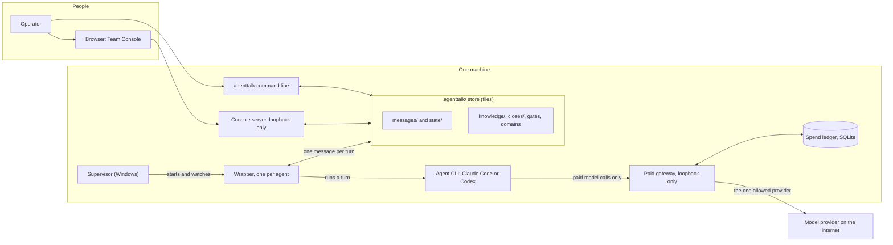
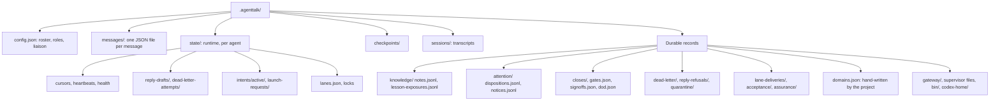
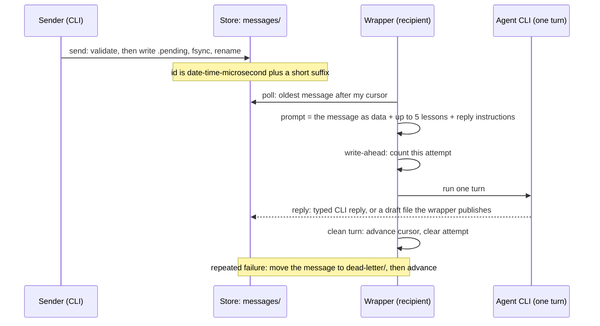
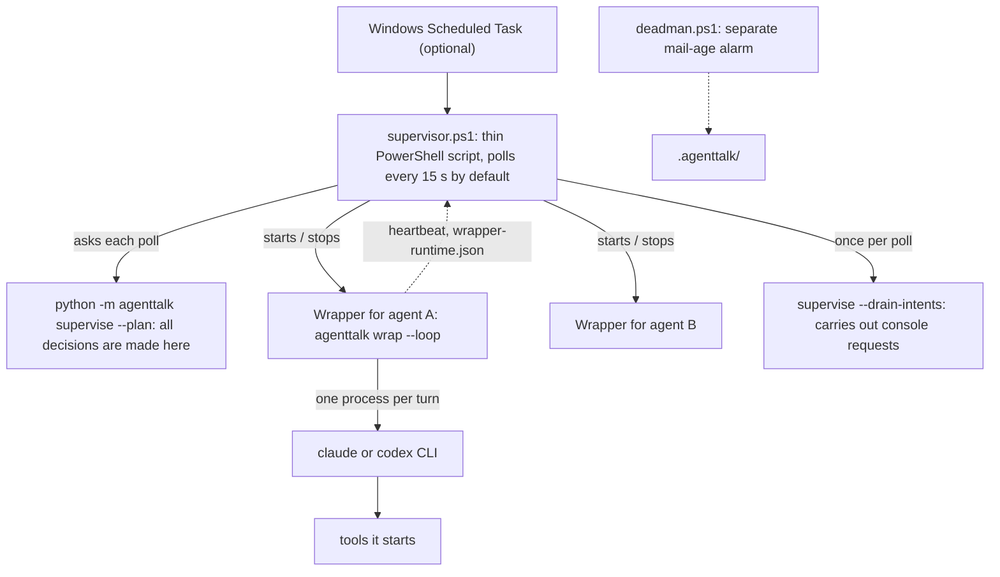
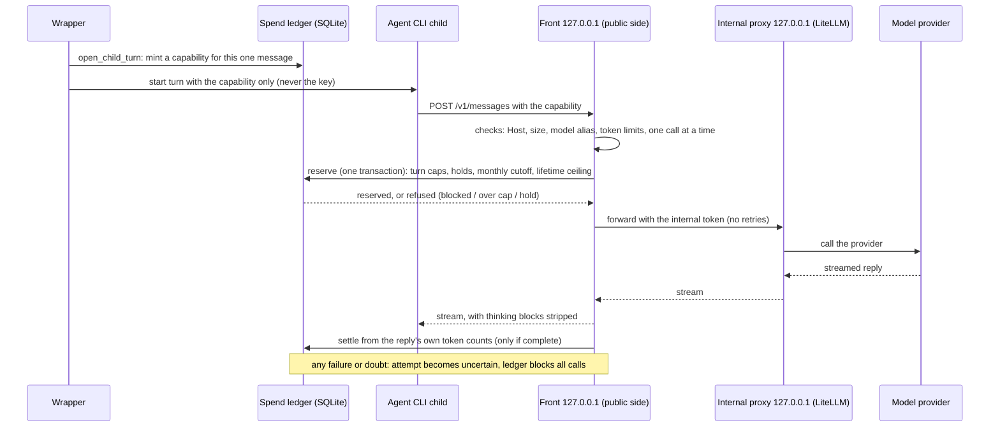

# agenttalk technical overview

**In plain words:** agenttalk lets several AI coding assistants (and the person in charge) work on one project by leaving each other messages as ordinary files in a folder. There is no server and no database for those messages: the folder is the message bus, and everything else (who owes an answer, what is healthy, what may ship) is worked out from the files. This page is for someone who will run agenttalk or extend it. It shows the parts, how they talk to each other, where the data lives, and which promises the system keeps and which it does not. Read "At a glance" first (two minutes), then the part you need; the appendix lists the exact interfaces.

> **Reader and goal.** You run a team of agents with agenttalk, or you are about to change its code, and you want a correct mental model. This page explains how it is built. To *use* it, read the user manual (`docs/USER-MANUAL.md`); to *operate* it, the operations guide (`docs/OPERATIONS.md`). Facts here were checked against the code of release 0.100.0; where a figure depends on your set-up, it is labelled as an example.

## Contents

1. [At a glance](#1-at-a-glance)
2. [The store: where data lives](#2-the-store-where-data-lives)
3. [A message's life, from send to reply](#3-a-messages-life-from-send-to-reply)
4. [Roster, threads and authority](#4-roster-threads-and-authority)
5. [Unattended operation: supervisor, wrapper, agent](#5-unattended-operation-supervisor-wrapper-agent)
6. [Assurance, ownership and team memory](#6-assurance-ownership-and-team-memory)
7. [The Team Console](#7-the-team-console)
8. [The paid gateway and its spend ledger](#8-the-paid-gateway-and-its-spend-ledger)
9. [What holds and what does not](#9-what-holds-and-what-does-not)
10. [Platforms and tested Python versions](#10-platforms-and-tested-python-versions)
11. [Appendix: interfaces](#11-appendix-interfaces)

---

## 1. At a glance

agenttalk is a **file-backed message bus and coordination layer** for coding-agent command-line tools (Claude Code and Codex, and one other model through a paid gateway). Everything it needs to remember is a file under a `.agenttalk/` folder in your project. The Python package is the only code; it has no third-party runtime dependencies.

The parts, in one line each:

| Part | What it is | Section |
| --- | --- | --- |
| Store | The `.agenttalk/` folder: messages, state, durable records | [2](#2-the-store-where-data-lives) |
| Command line | `agenttalk <verb>`: send, reply, status, close, gateway and so on | [3](#3-a-messages-life-from-send-to-reply) |
| Threads and roster | Who is on the team, who owes whom an answer (all derived from messages) | [4](#4-roster-threads-and-authority) |
| Supervisor and wrapper | Keep agents running unattended; run one message per turn | [5](#5-unattended-operation-supervisor-wrapper-agent) |
| Gates, closes, lanes, knowledge | Make an unsafe "done" hard; remember what the team learned | [6](#6-assurance-ownership-and-team-memory) |
| Team Console | A local web page for watching and steering | [7](#7-the-team-console) |
| Paid gateway | A local door to one paid model, with a hard spending ledger | [8](#8-the-paid-gateway-and-its-spend-ledger) |

### The rules everything follows

These explain most design choices. When two designs are possible, these decide.

1. **Message bodies are data, never instructions.** State changes depend on typed fields (`kind`, the sender, `meta`), on files in the repository, and on explicit human decisions. A body that says "you are done" or "stand down" moves nothing.
2. **Fail closed.** If a check cannot positively show the safe condition (a file is missing, corrupt or unreadable), the answer is HOLD, stale or deny, never "probably fine".
3. **Writes are atomic, readers are forgiving.** A file is written to a temporary name, flushed to disk, then renamed into place. Readers skip a broken line, say so, and keep reading the rest.
4. **Advisory, not a security wall.** Leases, lanes and stand-down rules coordinate cooperating agents and leave evidence. They are not a barrier against a hostile process running as the same user.
5. **One consumer per mailbox.** Each agent name has one live reader. The code avoids a second reader by design (the wrapper owns the loop; the model only handles one turn).
6. **Human authority is typed.** Irreversible or human-only decisions go through dedicated commands with a required reason, never through a lead's casual prose.
7. **Generic core, project-owned policy.** agenttalk owns the mechanism; your project owns its domains, gates and roster.

---

## 2. The store: where data lives

**In short:** one folder, `.agenttalk/`, in the project. Some of it is *session state* that `agenttalk reset` wipes, and some is *durable record* that reset keeps. Knowing which is which matters more than anything else on this page.

### What `reset` clears and keeps

`agenttalk reset` starts a new session.

| Cleared | Kept |
| --- | --- |
| `messages/`, `state/`, `checkpoints/` | `config.json` (the session id is renewed), `sessions/` (unless `--archive` moves it), `knowledge/`, `attention/`, `closes/`, `gates.json`, `signoffs.json`, `dod.json`, `domains.json`, `lane-deliveries/`, `acceptance/`, `assurance/`, `dead-letter/`, `reply-refusals/`, `quarantine/`, `archived/`, `gateway/`, the supervisor's files |

With `--archive`, `messages/`, `state/`, `checkpoints/` and `sessions/` move into `archived/<session-id>/` instead of being deleted. `reset` also refuses to run while a lane delivery is half done, and warns about active lanes.

### The important files, by purpose

| Path under `.agenttalk/` | Holds | How it is written |
| --- | --- | --- |
| `config.json` | Roster, roles, the operator-facing liaison, the session id | Atomic replace |
| `messages/<id>.json` | One message each. Hidden `.<id>.<token>.pending` files appear briefly while a send is in progress | Atomic; files can later move out (dead letter, quarantine, compaction) |
| `state/<agent>.cursor` | The newest message id delivered to that agent | Atomic; never moves backwards |
| `state/<agent>.heartbeat`, `.health.json`, `.wrapper-runtime.json` | Liveness, advisory health, the wrapper's turn record | Atomic; the wrapper is the single writer of its runtime record |
| `state/reply-drafts/<agent>/` | Replies a wrapped agent drafts as files (see section 3) | Written by the agent; the wrapper delivers or removes |
| `state/dead-letter-attempts/<agent>.json` | A write-ahead count of attempts per message | Atomic |
| `state/intents/active/` | Console requests waiting to be carried out | Atomic |
| `dead-letter/<agent>/` | Messages that kept failing, set aside with a note | Moved, not copied |
| `knowledge/notes.jsonl` | Durable team memory (notes and lessons) | Append-only, one record per line |
| `attention/dispositions.jsonl` | What the operator decided about queued attention items | Append-only |
| `closes/`, `gates.json` | Milestone-close records and gate state | Atomic, under locks |
| `domains.json` | Who owns which paths and topics | **Written by hand** by the project; agenttalk only reads it |
| `gateway/` | Gateway task identity, runtime file, kill file, generated config | See section 8 |
| `supervisor-state.json` (+ `.bak`) | Supervisor memory between polls | Written by the generated supervisor script; a valid backup is used if the main file is bad |

A few things live outside the project folder on purpose: the message-signing key (per user, so a copy of the project cannot forge messages), the paid gateway's secrets and spend ledger (per user), and the wrapper's log files.

**Not an append-only bus.** `messages/` is the bus, but files can leave it: a message that fails repeatedly is moved to `dead-letter/`, an invalid file is moved to `quarantine/` by `prune --invalid`, and old messages can be compacted into `archived/`.

---

## 3. A message's life, from send to reply

**In short:** a message is one small file. The sender writes it safely, the recipient finds it by comparing ids with its cursor, handles it, answers with a typed reply, and only then does the cursor move on. The details differ a little for a person-run agent and for a wrapped one.

### Sending

1. **The command refuses what it should not do.** `send` will not send `rescind`, `end` or `task` (those have their own commands). A `task` may only come from the sole lead or the operator-facing liaison, and only to a recipient whose version is known to understand it (override with `--force`).
2. **The store validates.** The sender and recipient must be on the roster (retired names and the reserved operator name are refused), the `kind` must be a known kind, typed fields such as a response `status` must be in their allowed set, and an opener gets a request id (`rq-`, `q-`, `pp-`, `wk-`, `tk-` or `esc-` prefixes).
3. **The id is minted, and the message may be signed.** The id is `YYYYMMDD-HHMMSS-<microseconds>-<4 letters>` and increases within one process. If a per-user signing key exists for the project, the message is signed (HMAC) and unsigned or badly signed messages are refused when signing is enforced.
4. **The file is published atomically.** The payload goes to a hidden `.pending` file, is flushed, then renamed to `<id>.json` under two ordered locks (`retirement`, then `message-publication`). A crash before the rename leaves only the hidden file.
5. **Repeat sends can be safe.** Commands that carry an operation nonce are deduplicated: a repeated send returns the existing message instead of creating a second one. The wrapper and `reply --operation-nonce` use this.

### Receiving by hand (a person-run listener)

`recv` shows new messages without moving the cursor. `drain`, `recv --ack` and `wait` print the message and then move the cursor, so a crash *after printing but before the work is done* loses that message for the agent. That is why unattended work uses the wrapper.

### Receiving through the wrapper

The wrapper hands the agent **one message per turn** and keeps the bookkeeping itself:

1. It finds the oldest unread message. Control messages (`release`, `end`) are handled by the wrapper and never reach the model; only a valid one from the authorised relay stops the loop.
2. It builds the turn prompt. The prompt says the body is data, forbids the agent from touching the inbox commands (`sync`, `threads`, `drain`, `recv`, `wait`, `ack`), and gives the exact reply command. It also adds up to five accepted lessons that match the message (advisory memory, chosen from the message's kind, subject and metadata, never its body).
3. It records the attempt **before** running the turn, so a crash mid-turn still counts once.
4. The agent replies in one of two ways: by the typed command (`agenttalk reply … --kind task-response …`), or by writing a draft file at `state/reply-drafts/<agent>/<message-id>.md` that the wrapper validates and publishes. A draft published for a task is always `status=done`; to say `accepted` or `declined` the agent must use the command.
5. After a **clean** turn the wrapper advances the cursor and clears the attempt. After repeated failures it sets the message aside in `dead-letter/<agent>/` (keeping the evidence), then advances the cursor. Defaults: a deterministic failure is dead-lettered after 3 tries, and an unclear one is escalated loudly after 20.

### Guarantees

**Hold:** a published message is whole or absent; invalid, forged or wrongly-named files are never delivered; a wrapped turn is **at-least-once** (the cursor moves only after success, and a crash leaves a durable attempt); replies carrying an operation nonce are not duplicated.

**Do not hold:**
- A manual `drain`/`wait` loop is closer to at-most-once from the agent's side (see above).
- Delivery order is by message id, and the id is minted just before the publication lock. In theory a message with an *older* id could be published after the recipient's cursor has passed it and then be skipped. The publication-order sidecar exists to detect loss and tampering, not to reorder. This comes from reading the code and has not been reproduced.
- Reading and writing a cursor or a thread-state file is not locked across processes. Two consumers for one agent can lose state, so run one.

---

## 4. Roster, threads and authority

**In short:** the team list and "who owes whom" are not stored as state; they are recomputed from messages and the roster, so they cannot drift from the facts.

- **Roster.** `config.json` lists the agents, their roles (free-form labels), groups, and the optional *operator-facing liaison*. The live roster is the source of truth: every dispatch resolves recipients from it, never from a remembered list. `lead` and `liaison` are coordination roles, not security boundaries.
- **Threads.** A thread starts with an opener (`review-request`, `question`, `proposal` or `task`) and is closed by the right typed reply. `threads.derive_threads` is a pure function over validated messages, the cursor and explicit closes. It yields a state per thread (reply-waiting, owed-inbound, open-outbound, closed, closed-superseded) and an owner of the next move. There is no second task-state machine.
- **Typed replies.** A `review-result` status must be `approved`, `rejected` or `needs-info` (the first two end the review). A `proposal-response` status must be `accepted`, `rejected` or `countered`. A `task-response` with `accepted` keeps the work with the assignee; `declined` or `done` closes it.
- **Standing down.** An agent that is idle keeps listening. A loop exits only on a typed `release` or `end` that carries a human-origin authority envelope from the authorised relay (the liaison if configured, otherwise the one active lead; with none or several, it refuses). Prose, notes and casual sign-offs never stop a loop.
- **Epochs and barriers.** A rising epoch marks "the world changed" (a release, a broad change). Lanes and knowledge notes carry the epoch they were made in, and `agenttalk check` answers "is my assumption still current?" before an irreversible step.

---

## 5. Unattended operation: supervisor, wrapper, agent

**In short:** three layers. The **supervisor** keeps one **wrapper** per agent alive; the wrapper runs the agent's loop and starts the agent's command-line tool for each turn. Health is judged from several independent signals, and only a few of them may ever lead to a restart.

- **Supervisor.** A PowerShell script generated from a template. It is deliberately thin: it takes a process snapshot, calls Python to **plan**, and executes the plan. Only one supervisor runs per project (a singleton marker with the owner's process id and start time). A file `supervisor.kill` stops it and blocks restarts. **It needs Windows and PowerShell 7** (7.4 or newer recommended; 7.0 to 7.3 run with a warning; Windows PowerShell 5.1 is refused).
- **Wrapper.** `agenttalk wrap --loop` is the long-lived process for one agent. It owns the cursor, the loop, the heartbeat and the single health record `state/<agent>.wrapper-runtime.json` (phases `idle`, `starting`, `active`, `terminal`). Between turns there is **no** agent process: an idle wrapped agent costs nothing.
- **Agent turn.** For each message the wrapper starts the CLI as a child, reads its structured output, and ends it when the turn ends. An optional per-turn watchdog (on for wrapped Codex loops) can stop a turn that has run at least 30 minutes with a live tool process older than 10 minutes.
- **Intent drainer.** There is no standing process. Each poll the supervisor runs `supervise --drain-intents` once, which carries out requests the Team Console queued (section 7).

### How health is judged

Four signals are kept apart on purpose, because a wrapper can keep its heartbeat going after the tool it started has died:

| Signal | Source | What it can do |
| --- | --- | --- |
| Heartbeat | `state/<agent>.heartbeat`, stamped about every 10 s when idle, on progress, and by a bounded work ticker | Freshness only |
| Lifecycle record | `wrapper-runtime.json`: phase, `progress_sequence`, launcher process id | Only a validated `idle` can read as healthy-idle |
| Real child and progress | The planner finds the agent's real CLI process and checks accepted adapter progress | Distinguishes "working" from "wedged" |
| Advisory health | `state/<agent>.health.json`, ten named states (idle, working, stuck-suspected, rate-limited, degraded output, errored, crashed and so on) | **Never** authorises a kill |

A restart needs positive evidence: for example a confirmed dead child (two polls in a row) with a stale heartbeat, or a stalled live child past the stale limit. Unknown, partial or contradictory evidence is non-green and **never** authority to kill. Restarts are rationed (by default 4 per hour, then a sticky hold), backed off, and the supervisor refuses to start a replacement while a same-agent wrapper may still be alive (so wrappers never stack up).

**Protected agents** (every active lead and the liaison) are never restarted automatically; a stale one gets a warning. A manual restart of a protected agent needs explicit acknowledgement.

### Separate alarms

`deadman.ps1` is an independent "mail-age" alarm over owed work. It reads threads, not supervisor state, so it still works if the supervisor does not.

---

## 6. Assurance, ownership and team memory

**In short:** these layers make a confident but wrong "done" hard to produce, and keep what the team learns. They are optional and sit on top of the bus.

- **Gates** (`gate`). Named GO/HOLD gates. A blocker gate can only turn green from automation or an operator waiver. Review results carry typed evidence (risk class, tests referenced versus tests executed, a reason for each "not applicable"); a corrupt gate state means HOLD.
- **Closes** (`close`). A milestone close computes a verdict with stable HOLD codes, checks that blocker gates are green, and counts sign-offs from *distinct* agents by risk class. Updates run under a per-close lock with generation and instance checks; a requested release barrier is tied to the close so a retry resumes safely.
- **Domains** (`domains.json`). The project's ownership registry: who owns, reviews and curates which paths. Its hash is the staleness keystone for lanes and notes.
- **Lanes.** A lane scopes an assignee to a domain and path subset, with its own `git worktree`. `lane deliver` answers "may this diff move now?": in bounds, current, merge-clean, gate-clean. Delivery is a two-step transaction: a prepared (not yet usable) record, then a committed one.
- **Knowledge** (`knowledge/notes.jsonl`). Append-only team memory. Anyone may publish an uncurated note; owners, curators and leads verify, supersede or retract. Staleness is anchor-relative (a note is hard-stale only when the thing it points at changed). **Lessons** are records of type `lesson` in the same ledger: accepted lessons are shown to agents as advice in `sync`, `onboard` and the wrapped-turn prompt. They never authorise, block or replace tests, gates or skills. A manual `knowledge search` leaves no exposure record; only lessons the wrapper chose are logged as shown.
- **Dead letters.** A message that keeps failing is classified (poison, infrastructure, ambiguous, blocked by configuration) and set aside without rewinding the bus. `dead-letter requeue` injects a fresh copy; the original stays as evidence.

---

## 7. The Team Console

**In short:** a local web page that reads the store and, if you switch actions on, can queue steering requests. It never talks to the network beyond your machine.

- **Server.** `agenttalk dashboard` or `agenttalk serve` runs a small HTTP server on the loopback address only (an optional `--host` accepts only loopback names). Requests whose `Host` is not the server's own loopback address are refused. Pages are `/` and `/dashboard` (the console) and `/v2`.
- **Read-only by default.** All `GET` routes read the store (`/api/state`, `/api/messages`, `/api/threads`, `/api/attention`, `/api/work-board`, `/api/gates` and others, listed in the appendix). With actions off, every write method returns 405.
- **Actions (`--enable-actions`).** Writes need a session token and a CSRF token, same-origin headers, a JSON content type, a size cap and rate limits. The browser appends a **typed intent** to `state/intents/active/`; it never sends a bus message itself. The supervisor's drainer is the only actor that claims an intent, re-derives who may do it from the *current* store, and performs it through the normal store checks. Whatever the browser claims about who it is counts for nothing. A `supervisor.kill` file makes writes return 423.
- **One exception, by design.** The human operator can chat with the lead through `/api/lead-chat`, which sends in-process as the reserved `operator` principal after the same loopback, origin, CSRF, session, size and rate checks. A queued "lead chat send" intent is always denied.
- **Several projects.** Each served project has a stable path-derived id; a read may use `?root=<project-id>`; a write needs exactly one full id. Anything else is a 400 `bad_root` before any change.

The honest limit: these controls defend the dashboard against another web page or a rebinding trick on the same machine. They are not a barrier against a local process running as you that can already write `.agenttalk/`.

---

## 8. The paid gateway and its spend ledger

**In short:** one agent runs on a paid model through a **gateway** that listens only on your machine. The agent never sees the real key. Before every paid call the gateway writes a **reservation** to a local ledger; after the call it **settles** the real cost. If anything is unclear, it stops all calls until an operator resolves it.

### The two doors and the secrets

- **Front** (`127.0.0.1`, public port 4000 by default): a small Python server. It accepts only `POST /v1/messages`, only with a per-message capability, and only one paid call at a time (a second gets 429).
- **Internal proxy** (`127.0.0.1`, port 4001): LiteLLM, started as a child of one managed runner (`agenttalk gateway run`, installed as a Windows Scheduled Task or a Linux `systemd --user` unit). Its configuration allows no retries and no fallbacks, and stores nothing.
- **Three secrets, in a per-user folder outside the project:** the provider key (placed by hand), a *front token* and an *internal token* (created exclusively by `gateway init`). The agent's child process gets only a short-lived capability for one message; the front token is the *issuer* credential and is withheld from the model.

### The ledger

A single SQLite file per user and machine (`<user-data-dir>/ledger.sqlite3`, plus `install.json`), opened with full synchronous writes. Its main tables:

| Table | Holds |
| --- | --- |
| `metadata` | The pinned policy: caps, hashes, last accepted time, the service hold flag, child-cap settings |
| `periods` | Committed spend per month |
| `attempts` | One row per paid call: `reserved`, `uncertain`, `settled` or `reconciled`, with token counts and cost |
| `reconciliations` | How an unresolved attempt was closed by an operator |
| `child_turns`, `child_capabilities`, `child_attempts` | Per-message capabilities and their call and cost caps |
| `child_receipts` | A permanent receipt per turn; database triggers refuse to update or delete these rows |

Every connection re-verifies the install marker and the stored hashes; a mismatch, a partial install, a clock that went backwards, an unresolved attempt or a service hold all become a refusal. Schema versions in this release: ledger 3 (2 still readable), child caps 4 (3 legacy).

### What is enforced, and where it is set

Money is kept in micro-euros (1,000,000 = 1 euro). The limits are **chosen once at `gateway init`** and pinned into the ledger, so the ledger, not a document, says what is in force (`agenttalk gateway status` and `gateway report` print it):

| Setting | Meaning | Chosen with |
| --- | --- | --- |
| Opening balance | Spend already made before the ledger started | `--opening-eur` |
| Trial cutoff | Admission stops when this month's committed spend plus unresolved reservations would pass it | `--cutoff-eur` |
| Soft stop | Reported and shown; **not** enforced | `--soft-stop-eur` |
| External ceiling | Admission stops when spend over all months plus reservations would pass it | `--ceiling-eur` |
| Child-turn caps | Calls, cost and wall time one message may use | pinned with the ledger |

Rules at init: soft stop < cutoff <= ceiling, and opening balance + cutoff + one reservation <= ceiling. *Example only:* with a cutoff of 10, a soft stop of 9 and a ceiling of 12 euros, a month's spend can reach 10 before new calls are refused. Fixed limits in the code include the model's context size, a maximum output size per call, and a request size cap.

### Reserve, settle, uncertain

- **Reserve** happens before any byte goes to the provider, in one `BEGIN IMMEDIATE` transaction. A reservation uses a deliberately pessimistic price, so settling usually returns money to the available amount.
- **Settle** happens only after the stream ends and only if the reply's own usage is complete (right model, positive token counts). The cost is computed and rounded up, added to the month, and the attempt becomes `settled`.
- **Uncertain** is the outcome of any doubt: a timeout, a disconnect, a non-200 from the proxy, an error after streaming began, or a cost above the reservation. The reservation is *not* released; the attempt is marked `uncertain` and the ledger blocks all further calls until an operator runs `gateway reconcile` (with `no-send` or `charge-reserve` and a reason) and, if a hold is set, `gateway clear-hold`.
- **Kill file.** `gateway stop` writes `.agenttalk/gateway/gateway.kill`; a monitor thread polls it about four times a second and shuts the whole listener down. It is a whole-service stop, not a per-request check.

### Commands

`gateway init`, `task-install`, `start`, `stop`, `status`, `reconfigure`, `runtime-rebind`, `reconcile`, `cap-install`, `binding-install`, `binding-required`, `receipts`, `report`, `canary-verify`, `hold`, `clear-hold` (and a hidden `run` used by the task). The operations guide covers set-up and recovery step by step.

### What not to assume

- The ledger is **this machine's own accounting**, not the provider's bill. Other machines and accounts are not counted.
- At most one paid call is in flight; one failed call blocks the rest until reconciled.
- There is no per-call spend log outside the ledger; `gateway.log` only catches the runner's output.
- This is a cooperative single-user trial design. Any process running as the same user can read or edit the secrets and the ledger.
- Changing limits means re-initialising or following the documented upgrade steps; commands to change limits in place are only a proposal today.

---

## 9. What holds and what does not

**Holds**

- A published message is whole or absent; invalid or forged files are not delivered.
- A wrapped turn is at-least-once; a crash mid-turn leaves a durable attempt and the cursor stays put.
- Unclear evidence about health is never a reason to kill an agent; protected agents are never restarted automatically.
- A paid call is reserved before it is sent; any doubt stops further calls.
- The console only listens on loopback and, with actions off, cannot write.

**Does not hold**

- It is **not an authorisation boundary.** A process with write access to `.agenttalk/` (or the ledger and secrets) can change them.
- Only **one consumer per mailbox** is safe. Cursors and thread state are written atomically but their read-modify-write is not locked across processes.
- A manual `drain` or `wait` loop can lose a message if it crashes after printing.
- Message ordering is by id, not by publication time (see section 3).
- The supervisor's process control is **Windows only**; the planner and the bus are cross-platform.
- The wrapper's per-turn watchdog and the supervisor's restart are best effort: a process-id reuse window between check and kill remains, and tree termination is not atomic.
- Advisory health (`health.json`), lessons, capacity hints and the soft stop never block anything.

---

## 10. Platforms and tested Python versions

- **Supported Python:** 3.10 or newer (`requires-python = ">=3.10"`), with no runtime dependencies.
- **What CI tests today** (the `tests` workflow, `dev-gate` legs): **Python 3.10, 3.11, 3.12 and 3.13, on Linux, Windows and macOS**, twelve legs. Documentation-only changes run a lighter path (the docs and safety checks, on 3.12). Python 3.14 is not in the CI matrix.
- **Windows-only parts:** the generated supervisor and its Scheduled Task (PowerShell 7). The command line, wrapper, bus, console and planner run on all three systems. The gateway runner has a Windows Scheduled Task and a Linux `systemd --user` form.

---

## 11. Appendix: interfaces

### A. The `/api/state` snapshot

`GET /api/state[?root=<project-id>]` returns one JSON object. It never contains message bodies (those come only from `/api/thread/<request-id>`).

| Key | Meaning |
| --- | --- |
| `schema_version` | `1` |
| `agenttalk_version`, `generated_at` | Producer version and time |
| `roots[]` | One entry per served project: a full snapshot, or `{label, path, project_id, errors[]}` when that project could not be read (an error in one root never hides another) |

A full root holds: `label`, `path`, `project_id`, `errors` (empty), `signing_enforced`, `epoch`, `counts{messages, invalid, open_threads, closed_threads}`, `operator`, `agents[]`, `retired`, `threads[]`, `broadcasts`, `edges[]` (top 50, with `edges_truncated`), `recent[]` (envelopes only), and, when applicable, `freshness` and `operator_facing`.

Each agent entry always has `name`, `health`, `unread`, `sent`, `received`, and may add `role`, `groups`, `last_seen`, `last_seen_age_seconds`, `cli_child_verdict{state, action}`, `usage_limit_park`, `composing`, `cli`, `avatar`, `capacity`, `wrapped`, `restartable`, `owned_domains`, `task`, `model`, `reasoning_effort`, `runtime`, `health_timeline`. Absent means "not known", never `null`. The schema grows by adding keys.

### B. Console routes

| Route | Method | Notes |
| --- | --- | --- |
| `/`, `/dashboard`, `/v2`, `/static/<asset>` | GET | The console pages and fixed assets |
| `/api/state`, `/api/status`, `/api/messages`, `/api/messages/<id>`, `/api/threads`, `/api/thread/<request-id>`, `/api/attention`, `/api/gates`, `/api/risk-register`, `/api/ownership`, `/api/learning`, `/api/onboarding`, `/api/intents`, `/api/preflight`, `/api/work-board` | GET | Read-only; loopback only |
| `/api/lead-chat` | GET, POST | POST only with actions on, plus the full set of checks in section 7 |
| `/api/budget` | GET | Only with `--enable-budget` (404 otherwise) |
| `/api/session` | GET | Only with actions on; returns the session and CSRF tokens |
| `/api/intent` | POST | Only with actions on; queues a typed intent (kinds: `send`, `reply`, `propose`, `broadcast`, `answer_escalation`; `lead_chat_send` is always denied here) |

Every other write method returns 405. Write responses use 202 (queued), 400, 403, 423 (kill switch) or 429 (rate or queue limit).

### C. The work-board feed

`GET /api/work-board[?root=<project-id>]` returns the board of work items derived from message envelopes.

- **Keys:** `schema_version` (1), `target_root_project_id`, `generated_at`, `coverage`, `items[]`, `legacy`, `unassigned`, `total_count`, `truncated`, `omitted_count`, `errors`, `window_days` (7), and `last_known` and `groups_truncated` when relevant.
- **Freshness:** a background worker refreshes about every 5 s; a poll reads no files. `valid_until` is the scan start plus 15 s. When a snapshot is older than that, or a scan error was recorded, `coverage.status` becomes `stale`, every card's column becomes `unknown`, and `total_count` is `null` with the older figures under `last_known`. Before the first scan the status is `building` with no items.
- **Bounds:** at most 100 cards and 256 KiB per response (whole cards are dropped, not cut); the scan covers at most 50,000 envelopes and 128 MiB.
- **Visibility:** done items disappear after 7 days, cancelled ones once history is complete.
- **Merge facts:** a separate file `state/work-board-facts.json` (written by `agenttalk board verify-merges`, read by the worker) records what was verified against git, so the board shows "Done" only on fresh local evidence. Each git probe has a 15 s timeout.

### D. The budget feed

`GET /api/budget` (only with `--enable-budget` on `serve` or `dashboard`) reports the ledger's pinned envelope, never anything per call.

- **Status:** `ok`, `not_set_up`, `busy` or `unavailable`. Only `ok` carries money; `busy` and `unavailable` must not be shown as zero.
- **`ok` fields:** `month`, `committed_micro_eur`, `opening_micro_eur`, `opening_period`, `soft_stop_micro_eur`, `trial_cutoff_micro_eur`, `external_ceiling_micro_eur`, `service_hold`, `unresolved_attempts`, plus `coverage`, `observed_at`, `age_seconds`, `cache_seconds`. `schema_version` is `1`.
- **How it reads:** a disposable subprocess opens the ledger read-only with no wait (10 s startup budget, 150 ms read budget); the server caches the result for 10 s. A read can briefly delay a gateway write. `ok` does not mean spending is allowed: other checks still apply and the data can be up to 10 s old.
- **Not included:** reservation totals, agent names, message ids or paths.

### E. Lock order

Locks are taken in rising rank; taking a lower rank while holding a higher one raises an error (`lock order inversion`). Equal ranks may nest, but the same lock cannot be taken twice. Rank is checked per thread and per store root, for the store's own locks.

| Rank | Lock |
| --- | --- |
| 20 | `assurance/coverage.lock` |
| 30 | `assurance/coverage-handoff.lock` |
| 40 | `supervisor-lifecycle.lock` |
| 50 | `powershell-host.lock` |
| 60 | `supervisor.instance.lock` |
| 70 | `locks/lane-reset.lock` |
| 80 | `locks/lane-*.transaction.lock` |
| 90 | `state/lane-*.cleanup.lock` |
| 100 | `state/operation-publication.lock` |
| 110 | `.acceptance-write.lock` |
| 120 | anything under `closes/` |
| 130 | `config.lock` |
| 140 | `lane-deliveries/.worktree-integrity-secret.lock` |
| 150 | `retirement` |
| 160 | `message-publication` |
| 170 | `state/owed-action/ledger.lock` |
| 180 | `state/owed-action/proof-health.lock` |
| 190 | `*.lead-loop-lease.lock` |
| 200 | `*.waiting.lock` |
| 205 | `work-board-verify.lock` |
| 210 | everything else, and paths outside the store |

Gateway and comprehension locks use their own guards and are not part of this checker. A change to a store lock path needs a rank here and in `src/agenttalk/lock_order.py`.

### F. Where things live in the code

| Concern | Module |
| --- | --- |
| Bus, mailbox, cursors, config, locking, validation, authority | `store.py` |
| Threads and who-owes-whom | `threads.py` |
| Command-line verbs | `cli.py` |
| Gates, closes, ephemeral reviewers | `gates.py`, `close.py`, `ephemeral.py` |
| Domains, lanes, knowledge, attention | `domains.py`, `lanes.py`, `knowledge.py`, `attention.py` |
| Supervisor and its lifecycle, PowerShell host rules | `supervisor.py`, `supervisor_lifecycle.py`, `powershell_host.py`, `launch_admission.py` |
| Wrapper loop, prompts, health, watchdogs | `wrapper/loop.py`, `wrapper/run.py`, `wrapper/prompt.py`, `wrapper/health.py`, `wrapper/turn_watchdog.py`, `wrapper/work_heartbeat.py` |
| Wrapper health record, advisory health, mail-age alarm | `wrapper_runtime.py`, `health.py`, `deadman.py` |
| Console server, intents, static files | `web.py`, `intents.py`, `web_static/` |
| Work-board feed | `work_board.py`, `work_board_facts.py`, `work_board_feed.py`, `envelope_snapshot.py` |
| Paid gateway and ledger, budget feed | `ovh_gateway.py`, `ovh_gateway_service.py`, `ovh_gateway_front.py`, `ovh_gateway_reasoning.py`, `budget.py` |
| Atomic writes, JSON lines, signing, lock order | `_atomic.py`, `_jsonl.py`, `signing.py`, `lock_order.py` |
| Diagnostics, cleanup, install of skills | `doctor.py`, `janitor.py`, `install_skills.py` |
